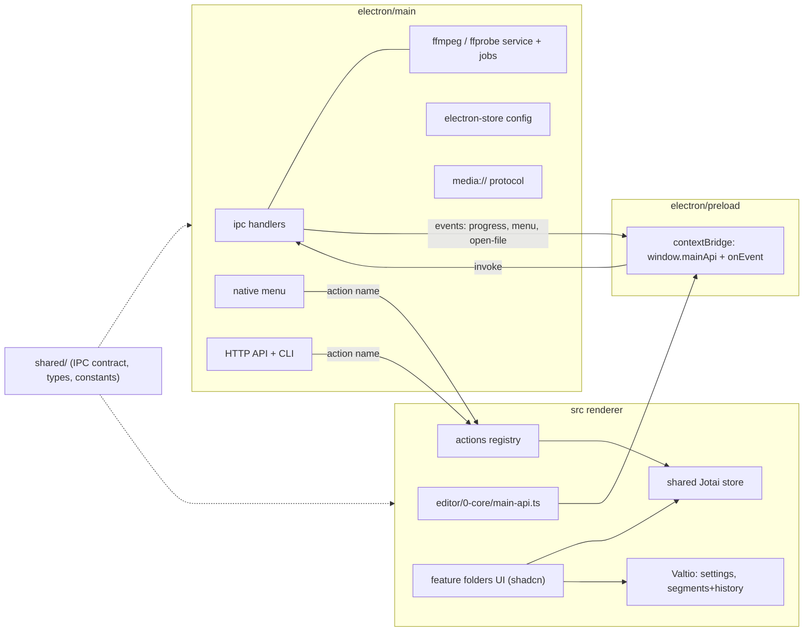

# LosslessCut port: Electron + shadcn + Jotai/Valtio

Upstream reference: [mifi/lossless-cut](https://github.com/mifi/lossless-cut) (`src/main`, `src/preload`, `src/common`, `src/renderer/src`).

## Key decisions

- **License**: switch the repo to GPL-2.0-only (`LICENSE` file, `package.json` `license` field, attribution in README and the About panel). This lets us port upstream logic directly.
- **Tooling**: use `electron-vite` for dev/build and `electron-builder` for packaging. The existing `vite.config.ts` settings (alias `@`, tailwind, chunk groups) move into the renderer section of `electron.vite.config.ts`.
- **Security (differs from upstream)**: run with `contextIsolation: true`, `nodeIntegration: false`, no `@electron/remote`, and keep `webSecurity` on. Upstream renderer code that touches `fs`/`path`/`execa` moves to the main process behind a typed IPC contract.
- **Media playback**: register a custom `media://` protocol (`protocol.handle`) that supports HTTP Range requests, so `<video>` can play local files without `file://` or disabling web security. Port upstream `compatPlayer.ts` (ffmpeg transcode streamed into Media Source Extensions) for codecs Chromium can't play.
- **ffmpeg**: we ship our own builds under `resources/ffmpeg/<platform>-<arch>/` (gitignored). `scripts/fetch-ffmpeg.mjs` downloads them, `electron-builder` `extraResources` packages them, and a user setting can override the path.
- **Template**: keep the Welcome page, Header, Footer, dialogs infrastructure and the theme. Delete `src/components/2-main/xyz-demos`. `MainBody` renders the new `<EditorRoot />`.
- **Package manager**: stay on pnpm. Add `electron` and `esbuild` to the build-script allowlist in `pnpm-workspace.yaml`, and `node-linker=hoisted` if electron-builder needs it.

## Architecture



## Repository layout

```
electron/
  main/
    index.ts              app lifecycle, single instance, open-file events
    window.ts             BrowserWindow creation and state
    protocol-media.ts     media:// with Range support
    ipc/handlers.ts       implements MainApi from shared/ipc-contract.ts
    ffmpeg/               paths.ts, ffmpeg.ts, ffprobe.ts, jobs.ts (progress+cancel), detect.ts, compat-player.ts
    config-store.ts       electron-store (port of configStore.ts)
    menu.ts, context-menu.ts, about-panel.ts
    http-server/, cli.ts, i18n.ts, logger.ts, update-checker.ts
  preload/index.ts        exposes window.mainApi (built from method list) and onEvent
shared/
  ipc-contract.ts         MainApi interface + event map (single source of truth)
  types/                  ffprobe, user settings, segments (port of src/common)
  constants.ts
src/                      renderer (existing template)
  components/             existing shell; 2-main renders <EditorRoot/>
  editor/                 NEW: all LosslessCut functionality
  ui/shadcn/              + alert-dialog, sheet, table, toggle-group, separator, badge, kbd, progress, hover-card, ...
resources/ffmpeg/         binaries (gitignored)
```

## Feature folders (`src/editor/`)

Every feature follows the same internal convention, so new features plug in without touching others:

```
src/editor/<n>-<feature>/
  0-state/      Jotai atoms and/or Valtio proxies
  1-actions/    write-only Jotai action atoms (commands)
  2-lib/        pure ported logic + *.test.ts (no React)
  3-ui/         shadcn-based components
  index.ts      public API of the feature
```

- `0-core/`: shared Jotai `store` (used by the `<Provider>`, IPC listeners and the actions registry), the typed `mainApi` client, IPC event subscriptions set up once at module load (not in `useEffect`), the actions registry, and promise-based dialogs (`await confirm(...)`, replacing sweetalert2).
- `1-layout/`: LosslessCut-like editor layout built on `react-resizable-panels` (sizes persisted in settings): TopMenu, the video and segment-list area, Timeline, BottomBar, and NoFileLoaded with drag and drop.
- `2-file/`: open/close file, ffprobe result, file format state, recent files, batch file list.
- `3-player/`: video element binding, play/pause, seek, rate, volume, rotation, playback stream selector, subtitles, compat player (MSE).
- `4-timeline/`: zoom and scroll, cursor, TimelineSeg, BetweenSegments, waveform and BigWaveform, thumbnails, keyframes.
- `5-segments/`: segments model, cut points, split/invert/merge/duplicate, labels, tags, select/deselect, segment list (dnd-kit reorder, `@tanstack/react-virtual`), auto-save, expression dialog (eval worker).
- `6-streams/`: tracks editor (port of StreamsSelector), tag editor, dispositions, GPS map (leaflet).
- `7-export/`: export sheet and confirm dialog, export modes (separate, merge, merge+separate, smart cut), output format select, file-name template editor, out-dir selector, progress and cancel, last ffmpeg commands log.
- `8-concat/`: merge-files dialog.
- `9-edl/`: project import/export (`.llc`, CSV, CUE, FCPXML, Premiere XML, CMX3600, YouTube chapters, PBF, SRT, MPlayer EDL, DV Analyzer). Ports `edlFormats.ts`, `edlStore.ts` and `cmx3600.ts`; file I/O goes through IPC.
- `a-capture/`: frame capture, extract frames dialog.
- `b-detect/`: segments from scene/black/silence detection, keyframes, fixed duration or count (runs in main `ffmpeg/detect.ts`).
- `c-keyboard/`: keybinding map, keyboard handler, KeyboardShortcuts editor dialog.
- `d-settings/`: Settings dialog (folded into the existing Options dialog infrastructure).
- `e-i18n/`: react-i18next setup, porting upstream locales.

## State management rules

- **Valtio** for large, mutable, persisted objects:
  - `userSettings`: mirrored to the main-process electron-store through IPC with a debounced `subscribe`.
  - `segments` with undo/redo via `valtio-history` (replaces upstream immer + history in `useSegments.tsx`).
- **Jotai** for everything else:
  - Primitive atoms for transient UI state (current file, playing, zoom, dialog open flags).
  - Derived atoms (selected segments, sorted cut points, export-ready flags).
  - `atomFamily` (`jotai-family`, already installed) for per-segment and per-stream state.
  - Write-only action atoms for every command, e.g. `splitSegmentAtom`, `setCutStartAtom`, `exportAtom`.
- **Side effects**: use `jotai-effect` for reactions such as loading keyframes/waveform on file change and auto-save. Video element events call `store.set(...)` directly. Together these replace most `useEffect`/`useCallback`.
- **High-frequency time**: `playerTimeAtom` updates through `requestVideoFrameCallback` and is read only by small leaf components (cursor, time display), so the tree never re-renders per frame.
- **Actions registry**: one map from action name to action atom (port of upstream `mainActions`). Keyboard bindings, the native menu, the HTTP API, and a new cmdk command palette all dispatch through it. `cmdk` is already installed.

## Library mapping (upstream to ours)

- sweetalert2, @radix-ui/themes, CSS modules, sass: replaced by shadcn components and Tailwind (following `.cursor/rules/tailwind-class-order.mdc`).
- react-icons: replaced by lucide-react plus the existing `src/ui/icons`.
- Toasts: sonner (already present).
- Kept: dnd-kit, @tanstack/react-virtual, leaflet/react-leaflet, smpte-timecode, luxon, csv-parse/stringify, fast-xml-parser, cue-parser, nanoid, p-map, pretty-bytes, json5, zod.
- Main process: execa, electron-store, express, yargs-parser, winston, i18next, file-type, mime-types.

## Ideas for later (beyond parity)

- `pnpm dev:web`: renderer in a plain browser with a mocked `mainApi`, for fast UI work.
- Command palette (cmdk) driven by the actions registry.
- User-configurable panel layout presets, since the layout will change later anyway.
