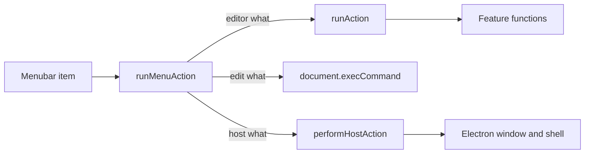

# Move the application menu into the web UI

The native menu in [electron/main/menu.ts](electron/main/menu.ts) is the only top-level menu. Editor commands already land in `runAction` via `emitToRenderer('action', …)`. Window, zoom, About, and shell commands bypass that and call Electron roles or `shell` directly. The in-app [TopMenu](src/editor/7-export/0-ui/top-menu/top-menu.tsx) toolbar stays as it is; this work adds the File / Edit / Segments / View / Tools / Help bar.

## Action shape

One renderer entry, [src/editor/1-layout/7-actions/run-menu-action.ts](src/editor/1-layout/7-actions/run-menu-action.ts). The menu UI calls only `runMenuAction`. No `useState`; visibility comes from existing Jotai atoms (`newVersionAtom`, and `canUndoAtom` / `canRedoAtom` / `isFileOpenedAtom` only to disable items that already have that state).

`MenuAction` is a discriminated union. Every variant has `what`. Extra fields exist only when that command needs them:

- Editor commands with no args: `{ what: 'openFilesDialog' }`, `{ what: 'closeCurrentFile' }`, `{ what: 'toggleSettings' }`, and the rest of the names already registered in feature `index.ts` files (segments, detect, concat, streams, keyboard, settings).
- Editor commands with args: `{ what: 'importEdlFile'; format: EdlImportType }`, `{ what: 'exportEdlFile'; format: EdlExportType }`.
- Clipboard roles: `{ what: 'edit'; command: 'cut' | 'copy' | 'paste' | 'selectAll' }`.
- Host commands (shared type below): `{ what: 'quit' }`, `{ what: 'zoom'; direction: 'in' | 'out' | 'reset' }`, `{ what: 'openExternal'; url: string }`, and the other host variants.

The switch in `run-menu-action.ts` does not contain the work:

- Editor `what` values call `runAction(action.what)` or `runAction('importEdlFile', action.format)`. Implementations stay in the feature modules that already register those names. Keyboard, command palette, and the HTTP API keep using that registry.
- `edit` calls a small `runEditCommand` in [src/editor/1-layout/7-actions/edit-command.ts](src/editor/1-layout/7-actions/edit-command.ts) (`document.execCommand`). Undo and Redo stay the segment actions (`undo` / `redo`), which is what Ctrl/Cmd+Z already does outside text fields. Text undo stays the browser default while an input is focused, because the keyboard listener already ignores those targets.
- Host `what` values call one new IPC method, `mainApi.performHostAction(action)`.

## Electron side

Add `HostMenuAction` in [shared/ipc-contract.ts](shared/ipc-contract.ts) and `performHostAction(action: HostMenuAction)` on `MainApi` (and `mainApiMethods`). Variants:

- `quit`, `minimize`, `toggleMaximize`, `toggleFullscreen`, `toggleDevTools`, `showAbout`
- `zoom` with `direction: 'in' | 'out' | 'reset'` (`webContents` zoom level; reset is level 0)
- `openExternal` with `url`
- `showItemInFolder` with `path` (config file; path comes from `getAppInfo().paths.configFile`)
- `openPath` with `path` (log file)

[electron/main/ipc/handlers.ts](electron/main/ipc/handlers.ts) forwards that method to one file, [electron/main/host-menu-action.ts](electron/main/host-menu-action.ts). That file only switches on `what` and calls functions in [electron/main/host-actions/window.ts](electron/main/host-actions/window.ts) and [electron/main/host-actions/shell.ts](electron/main/host-actions/shell.ts). `quit`, fullscreen, devtools, and `openExternal` move here; the old `MainApi` methods stay for the callers that already use them (`quit` action, settings links, export dialogs).

The web mock in [src/editor/0-core/8-lib/web-mock.ts](src/editor/0-core/8-lib/web-mock.ts) implements `performHostAction` as a no-op except `openExternal`, which keeps using `window.open`.

## Remove the native menu

- Windows and Linux: `Menu.setApplicationMenu(null)`, and create the window with `autoHideMenuBar: true` so the empty bar does not flash. See [electron/main/window.ts](electron/main/window.ts).
- macOS cannot drop the system menu bar. Replace [electron/main/menu.ts](electron/main/menu.ts) with a minimal application menu (About, Hide, Quit) only. File through Help live in the shadcn bar on every platform, including macOS. Exit stays off the web File menu on macOS because Quit remains in that system menu.
- Stop calling `updateMenu()` from [electron/main/index.ts](electron/main/index.ts) and from `setLanguage` in the IPC handlers. Main-process i18n still updates for the quit confirmation dialog.
- Delete the renderer `setMenuState` push in [src/editor/2-file/7-actions/file-effects.ts](src/editor/2-file/7-actions/file-effects.ts) and remove `MenuState` / `setMenuState` from the IPC contract, handlers, app state, and the web mock. Nothing in the native menu read that state.

The `'action'` main-to-renderer event stays so the HTTP/CLI path is unchanged. After this, the application menu no longer emits it.

## shadcn menubar

Mount a new `AppMenu` from [src/components/1-header/0-header-all.tsx](src/components/1-header/0-header-all.tsx), between the logo and the header buttons, so it is visible on the welcome page and in the editor. Implement it with [src/ui/shadcn/menubar.tsx](src/ui/shadcn/menubar.tsx) under [src/editor/1-layout/0-ui/app-menu/](src/editor/1-layout/0-ui/app-menu/).

The item tree matches today’s menu: same `t('…')` keys, same separators, same import/export format lists (`EdlImportType` / `EdlExportType` from [src/editor/0-core/8-lib/types.ts](src/editor/0-core/8-lib/types.ts)). Each item’s `onSelect` passes a `MenuAction`. Shortcuts render with `MenubarShortcut`.

Platform rules, from `getAppInfo()` (already loaded before render):

- View → Minimize / Maximize on Windows only.
- File → Exit on Windows and Linux only.
- Help → About on Windows and Linux only (macOS About stays on the system menu).
- “New version!” menu when `newVersionAtom` is set; the item opens `getReleaseUrl(version)` through `{ what: 'openExternal', url }`.

Disable Undo / Redo from `canUndoAtom` / `canRedoAtom`. Leave other items enabled; the native menu did not use `MenuState` to disable them, and the actions already guard themselves.

## Shortcuts that the native menu owned

These are not in `defaultKeyBindings` (plain `KeyO` is “set cut end”, plain `Comma` seeks a frame). Handle them in [src/editor/c-keyboard/7-actions/keyboard-listener.ts](src/editor/c-keyboard/7-actions/keyboard-listener.ts) the same way as the command palette, by calling `runMenuAction`, and `preventDefault`:

- Ctrl/Cmd+O open, Ctrl/Cmd+W close, Ctrl/Cmd+, settings
- Ctrl/Cmd+Plus / Minus / 0 zoom
- F11 fullscreen
- Ctrl/Cmd+Shift+I developer tools
- Ctrl/Cmd+M minimize (Windows)

Ctrl/Cmd+Z and Ctrl/Cmd+Shift+Z stay on the existing segment undo bindings. Cut, copy, paste, and select-all stay browser defaults.

Update the one sentence in [src/editor/README.md](src/editor/README.md) that says the native Electron menu is a `runAction` caller, so it points at `runMenuAction` instead.