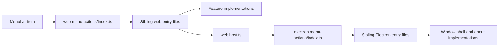

# Move the application menu into the web UI

The native menu in [electron/main/menu.ts](electron/main/menu.ts) is the only top-level menu. Editor commands already land in `runAction` via `emitToRenderer('action', …)`. Window, zoom, About, and shell commands bypass that and call Electron roles or `shell` directly. The in-app [TopMenu](src/editor/7-export/0-ui/top-menu/top-menu.tsx) toolbar stays as it is; this work adds the File / Edit / Segments / View / Tools / Help bar.

## Two catalogs, one per world

Entry points are centralized so a call from the web UI into Electron is visible by which folder it passes through. Implementations stay where they already live. The menu UI, keyboard accelerators, and IPC handler only call the listing file in their own world.

Web catalog, [src/editor/0-core/menu-actions/](src/editor/0-core/menu-actions/):

- `index.ts` lists every menu entry and is the only web function callers use: `runMenuAction(action)`. It switches on `what` and calls a sibling file. It does not contain the work.
- `file.ts`, `edit.ts`, `segments.ts`, `view.ts`, `tools.ts`, `help.ts` are the web-owned entries. Each function calls the existing feature implementation (`openFilesDialog` in the file feature, `importEdlFile` in the edl feature, segment functions, and so on). Undo and Redo call the segment `undo` / `redo` functions. Cut, copy, paste, and select-all call `document.execCommand` through a tiny helper in [src/editor/0-core/8-lib/](src/editor/0-core/8-lib/).
- `host.ts` is the only web file that crosses the boundary. Every host `what` is a function here, and each one calls `mainApi.performHostAction(action)`.

Electron catalog, [electron/main/menu-actions/](electron/main/menu-actions/):

- `index.ts` lists every host entry: `performHostAction(action)`. [electron/main/ipc/handlers.ts](electron/main/ipc/handlers.ts) forwards the IPC method to this file and does not switch itself.
- `window.ts`, `shell.ts`, and `about.ts` sit next to that list. They call implementations that stay in the modules that already own the work: window controls and zoom in [electron/main/window.ts](electron/main/window.ts), `shell.openExternal` / `showItemInFolder` / `openPath` in a small shell module used by both this catalog and the existing `MainApi` methods, and About via [electron/main/about-panel.ts](electron/main/about-panel.ts).

Keyboard, command palette, and the HTTP API keep using `runAction` and the feature registries. Menu clicks do not. Where a menu entry and a registered action share a name, both call the same feature function.

No `useState` in the menu. Visibility uses existing Jotai atoms (`newVersionAtom`, plus `canUndoAtom` / `canRedoAtom` to disable Undo and Redo).

## Action shape

`MenuAction` lives next to the web catalog. Every variant has `what`. Extra fields exist only when that command needs them:

- No extra fields: `{ what: 'openFilesDialog' }`, `{ what: 'closeCurrentFile' }`, `{ what: 'toggleSettings' }`, and the other names already implemented in feature modules.
- With fields: `{ what: 'importEdlFile'; format: EdlImportType }`, `{ what: 'exportEdlFile'; format: EdlExportType }`, `{ what: 'edit'; command: 'cut' | 'copy' | 'paste' | 'selectAll' }`.
- Host commands use the shared `HostMenuAction` type: `{ what: 'quit' }`, `{ what: 'zoom'; direction: 'in' | 'out' | 'reset' }`, `{ what: 'openExternal'; url: string }`, and the other host variants. `MenuAction` includes that union, so `host.ts` can forward the same object.

`HostMenuAction` is added to [shared/ipc-contract.ts](shared/ipc-contract.ts), with `performHostAction(action: HostMenuAction)` on `MainApi` and in `mainApiMethods`. Variants:

- `quit`, `minimize`, `toggleMaximize`, `toggleFullscreen`, `toggleDevTools`, `showAbout`
- `zoom` with `direction: 'in' | 'out' | 'reset'` (`webContents` zoom level; reset is level 0)
- `openExternal` with `url`
- `showItemInFolder` with `path` (config file; path comes from `getAppInfo().paths.configFile`)
- `openPath` with `path` (log file)

Existing `MainApi` methods (`quitApp`, `toggleFullscreen`, `toggleDevTools`, `openExternal`, `showItemInFolder`) stay for settings links, export dialogs, and the registered `quit` action. They call the same shell and window implementations as the Electron catalog, so the behavior is not copied.

The web mock in [src/editor/0-core/8-lib/web-mock.ts](src/editor/0-core/8-lib/web-mock.ts) implements `performHostAction` as a no-op except `openExternal`, which keeps using `window.open`.

Text undo stays the browser default while an input is focused, because the keyboard listener already ignores those targets. The Edit menu Undo / Redo items run segment undo.

## Remove the native menu

- Windows and Linux: `Menu.setApplicationMenu(null)`, and create the window with `autoHideMenuBar: true` so the empty bar does not flash. See [electron/main/window.ts](electron/main/window.ts).
- macOS cannot drop the system menu bar. Replace [electron/main/menu.ts](electron/main/menu.ts) with a minimal application menu (About, Hide, Quit) only. File through Help live in the shadcn bar on every platform, including macOS. Exit stays off the web File menu on macOS because Quit remains in that system menu.
- Stop calling `updateMenu()` from [electron/main/index.ts](electron/main/index.ts) and from `setLanguage` in the IPC handlers. Main-process i18n still updates for the quit confirmation dialog.
- Delete the renderer `setMenuState` push in [src/editor/2-file/7-actions/file-effects.ts](src/editor/2-file/7-actions/file-effects.ts) and remove `MenuState` / `setMenuState` from the IPC contract, handlers, app state, and the web mock. Nothing in the native menu read that state.

The `'action'` main-to-renderer event stays so the HTTP/CLI path is unchanged. After this, the application menu no longer emits it.

## shadcn menubar

Mount a new `AppMenu` from [src/components/1-header/0-header-all.tsx](src/components/1-header/0-header-all.tsx), between the logo and the header buttons, so it is visible on the welcome page and in the editor. Implement it with [src/ui/shadcn/menubar.tsx](src/ui/shadcn/menubar.tsx) under [src/editor/1-layout/0-ui/app-menu/](src/editor/1-layout/0-ui/app-menu/).

The item tree matches today’s menu: same `t('…')` keys, same separators, same import/export format lists (`EdlImportType` / `EdlExportType` from [src/editor/0-core/8-lib/types.ts](src/editor/0-core/8-lib/types.ts)). Each item’s `onSelect` passes a `MenuAction`. Shortcuts render with `MenubarShortcut`.

Platform rules, from `getAppInfo()` (already loaded before render):

- View → Minimize / Maximize on Windows only.
- File → Exit on Windows and Linux only.
- Help → About on Windows and Linux only (macOS About stays on the system menu).
- “New version!” menu when `newVersionAtom` is set; the item opens `getReleaseUrl(version)` through `{ what: 'openExternal', url }`.

Disable Undo / Redo from `canUndoAtom` / `canRedoAtom`. Leave other items enabled; the native menu did not use `MenuState` to disable them, and the actions already guard themselves.

## Shortcuts that the native menu owned

These are not in `defaultKeyBindings` (plain `KeyO` is “set cut end”, plain `Comma` seeks a frame). Handle them in [src/editor/c-keyboard/7-actions/keyboard-listener.ts](src/editor/c-keyboard/7-actions/keyboard-listener.ts) the same way as the command palette, by calling `runMenuAction`, and `preventDefault`:

- Ctrl/Cmd+O open, Ctrl/Cmd+W close, Ctrl/Cmd+, settings
- Ctrl/Cmd+Plus / Minus / 0 zoom
- F11 fullscreen
- Ctrl/Cmd+Shift+I developer tools
- Ctrl/Cmd+M minimize (Windows)

Ctrl/Cmd+Z and Ctrl/Cmd+Shift+Z stay on the existing segment undo bindings. Cut, copy, paste, and select-all stay browser defaults.

Update the one sentence in [src/editor/README.md](src/editor/README.md) that says the native Electron menu is a `runAction` caller, so it points at the web `menu-actions` catalog instead.
